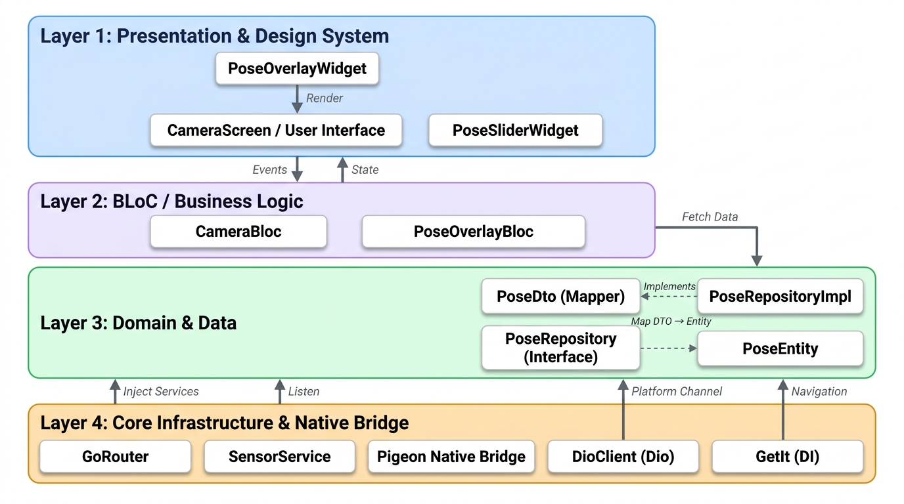

# Kiến Trúc Project — Pose Guide

---

## Mô tả các Layer

| Layer | Thành phần |
|-------|-----------|
| **Layer 1** — Presentation & Design System | `PoseOverlayWidget`, `CameraScreen / User Interface`, `PoseSliderWidget` |
| **Layer 2** — BLoC / Business Logic | `CameraBloc`, `PoseOverlayBloc` |
| **Layer 3** — Domain & Data | `PoseDto (Mapper)`, `PoseRepositoryImpl`, `PoseRepository (Interface)`, `PoseEntity` |
| **Layer 4** — Core Infrastructure & Native Bridge | `GoRouter`, `SensorService`, `Pigeon Native Bridge`, `DioClient`, `GetIt` |

## Luồng dữ liệu

- **UI → BLoC**: dispatch `Events`
- **BLoC → UI**: emit `State`
- **BLoC → Domain/Data**: `Fetch Data`
- **Layer 4 → Tất cả**: `Inject Services`, `Listen`, `Platform Channel`, `Navigation`
